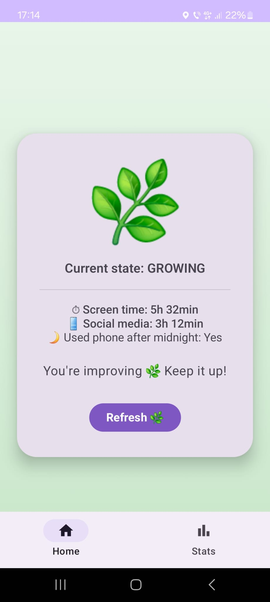
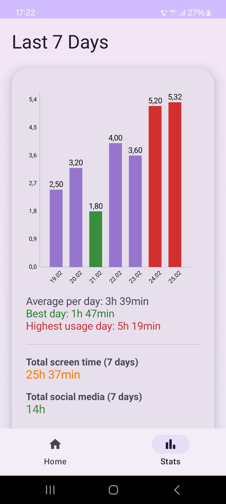

# 🌱 PlantMood

PlantMood is an Android application that monitors daily screen time and reflects digital habits through the visual state of a virtual flower.

The healthier the screen usage, the more the plant flourishes.

---

## Motivation

Modern users spend a significant amount of time on their phones, often without being fully aware of it.  
This application was developed to encourage digital awareness and promote healthier technology habits through simple and intuitive visual feedback.

Instead of displaying only numerical statistics, PlantMood transforms usage behavior into a dynamic visual representation.

---

## Features

- Daily screen time monitoring
- Dynamic plant state based on usage
- Usage statistics chart
- Modern UI built with Jetpack Compose
- MVVM clean architecture

---

## Tech Stack

- Kotlin
- Jetpack Compose
- MVVM Architecture
- Room Database
- Coroutines

---

## Screenshots

### Main Interface

### Usage Statistics

---

## Permissions Required

- Usage Access – required to detect foreground app usage and calculate daily screen time.

---

## Setup

1. Clone the repository
2. Open the project in Android Studio
3. Build and install on a physical device
4. Grant the required permissions when prompted

---